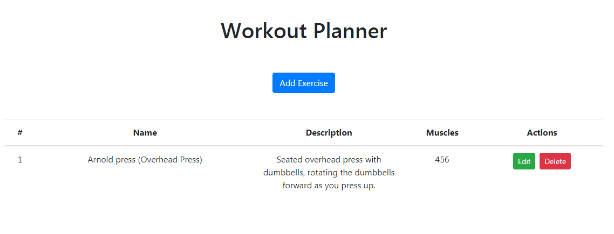
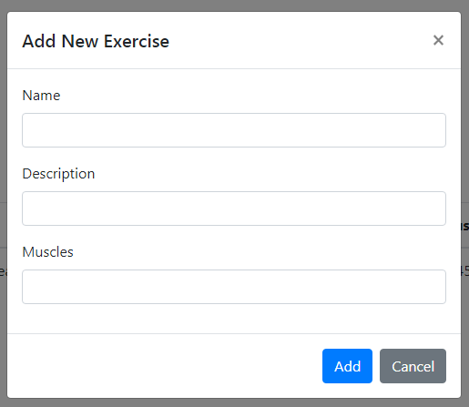

# workout-plan

Generates daily workouts to help clients feel their best and maintain wellness. Clients can create & track manual workouts. Clients will be able to access curated workout plans, upload workouts to Google Calendar, and receive reminders via SMS and email.

## Technologies

* React
* SQL

## Step 1: Coming up with MVP

Upon starting, I brainstormed all relevant features and picked 3 _key_ features for my MVP.

Features: 
* **Initial assessment** ("How difficult do you want your workouts to be? How many days per week?")
* **Manual workout planner & tracker**: Clients will be able to add their own exercises to daily workouts, & track their progress as they exercise (how many sets, reps, weight, etc.)
* **Pre-curated workouts**: The app curates a set of workouts based on what the client wants today (Do they want an arm-abs workout, leg day, or full body? How much time do they have?)
* Access 
* Authentication
* Stats
* Connect & chat with "workout buddies" 

The three features in bold are what I chose to focus on first. Once my MVP is in place, I will implement those in order.

## Step 2: Creating a database

I started out using a open-sourced 3rd-party API. However, for my app's needs, and due to the exercise data, while being thorough, being highly inconsistent and unstandardized between contributors, I decided to create my own database using SQL. 
I created tables & inserted data for exercise groups & muscles. 
My next steps are to create API endpoints with GET, POST, PUT, and DELETE routes.

I want to be able to name multiple muscles per exercise. My challenge is that I'd want my muscles in a JSON object to be grouped in an array like this:
`muscles: [
  4, 
  5, 
  6
 ]`

In MySQL, arrays are not a recognized data type for a column, but I can create a separate table that relates to both the muscles & exercises table, listing exercise IDs and their corresponding muscle group IDs. I can group these together in a LEFT JOIN. 
While I work on the architecture to reflect those relationships in a simple way, I used [json-server](https://github.com/typicode/json-server) to create a dummy JSON file reflecting my desired data structure. 

I then created my frontend table components in React, so that users can view current exercises, add, and remove them.

## Step 3: Creating React components
I set up an interactive table as a means to test my API endpoints and use those to populate my database. These data points will come in handy as I add on my desired UI features, and I find less tedious than populating the database in a more manual fashion. And, in the meanwhile, I have something of a UI to build off from, and a way to present my work.

I used [Reactstrap](https://reactstrap.github.io/) (React Bootstrap library) for styling.

I wanted a Modal component to pop up when the user adds or edits an exercise. However, the modal would not render and I received an error message that Reactstrap Modal's built-in toggle method was undefined, despite having imported the Modal component at the top of my code. Separating the Modal into a child component and using the doc's example of using a hook to define toggle solved my problem. My modal now renders when I click the "Add Exercise" button. 

Here's my result currently:

This posed a new **challenge**: I have always built single-component React apps, and was not experienced with passing methods & values between parent & child. I'd have to pass the method as a callback, and pass parameters, then have that callback update the parent component's state.

## Step 4: Setting up REST API calls in React
I set up GET, PUT, POST, and DELETE HTTP endpoints, and put these endpoints into methods in the parent component. I chose the Axios client for my API because it handles promises well.

I passed the methods containing these endpoints, as well as methods to update state upon user input, to the child Modal component. These modals contain a form where the user can add exercises to our database, or edit an existing exercise in the database. I have event handlers that will track these changes in state. When the Add or Save Changes button is clicked, our HTTP endpoint will reflect data in our state to add (POST) data, or edit (PUT). 

**Overcoming the challenges** of passing methods & state variables from parent to child, and passing user input from the child to parent to update state, took several hours and attempts, but ultimately was very satisfying and gave me a deeper understanding of front-end Javascript concepts, including data binding.

Methods to corresponding endpoints are: 
* _refreshData() for GET endpoint
* addExercise() for POST 
* updateExercise() for PUT 
* deleteExercise() for DELETE
